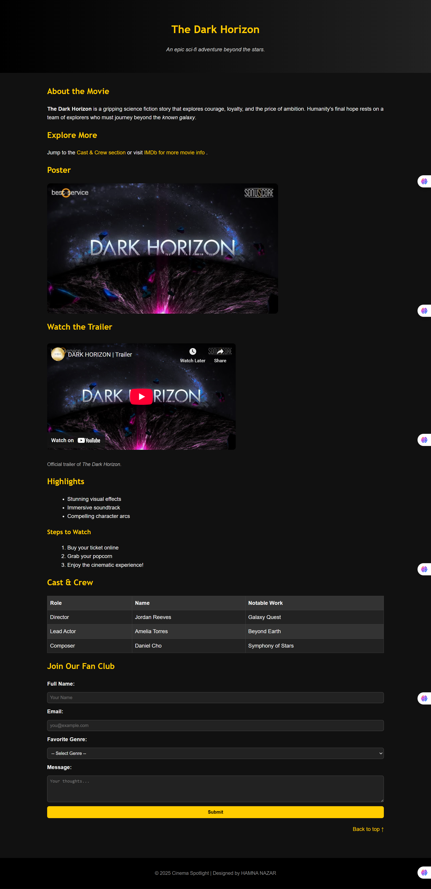

# 🎬 Cinema Spotlight: *The Dark Horizon*

A responsive web page project highlighting the fictional sci-fi movie **The Dark Horizon**.  
This page showcases the movie’s storyline, cast, trailer, highlights, and includes an interactive **fan club form**.

---

## 🌟 Features

- 📝 **About Section** – brief overview of the movie  
- 🔗 **Quick Navigation** – internal links to jump between sections  
- 🎥 **Trailer Embed** – official YouTube trailer integration  
- 🖼️ **Poster Display** – movie poster with alt text for accessibility  
- 🌌 **Highlights** – unordered and ordered lists for features & steps  
- 🎭 **Cast & Crew Table** – structured with role, name, and notable work  
- 📩 **Fan Club Form** – signup form with input validation  
- ⬆️ **Back to Top link** for smooth navigation  
- 📱 **Responsive design** (works on desktop & mobile)  

---

## 📸 Preview

  

---

## 📂 Project Structure

```text
project-root/
│-- index.html        # Main HTML file
│-- style.css         # Stylesheet for design
│-- assets/
│    └── poster.jpg   # Movie poster
│-- preview.png       # Screenshot for README

```
---
## ⚡ How to Run

1- Clone the repository:

git clone https://github.com/your-username/the-dark-horizon.git

2- Open the project folder:

cd the-dark-horizon

3- Open index.html in your browser.

---

## 🛠️ Technologies Used

1- HTML5 – Structure & semantic tags

2- CSS3 – Styling & layout

3- Responsive Design – Mobile-friendly

---

##  👩‍💻 Author
Hamna Nazar

---